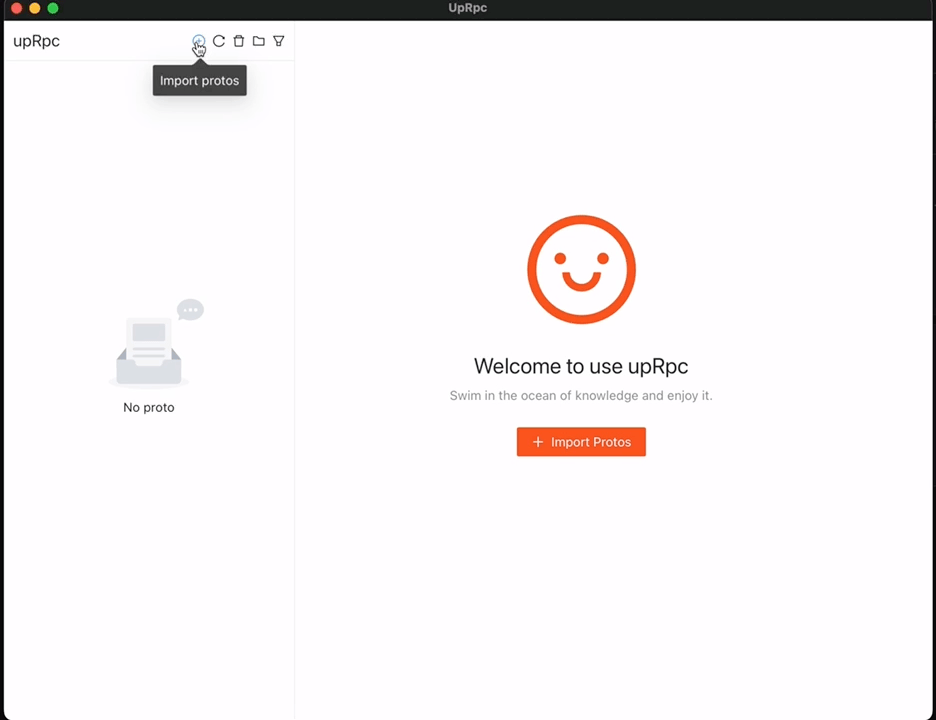

<p align="center">
    
</p>
<h1 align="center">UpGrpc</h1>
<p align="center">最简单易用的gRPC客户端工具。</p>
<p align="center"><b>UpRpc</b>为开发者提供最简单和最高效的gRPC开发过程体验，旨在解决gRPC接口调试过程中遇到的问题，方便开发者定位问题。
</p>

English | [简体中文](./README-zh_CN.md)

## ✨ 特性

-   支持 gRPC 的 4 种请求/响应模式：基本、客户端数据流、服务器端数据流以及双向数据流
-   支持请求和响应 Metadata 编解码
-   支持多个 proto 文件导入
-   支持多 Tab 操作
-   支持自定义配置持久化

## 路线图

-   v 1.1.0
    -   支持环境变量
-   v 1.2.0
    -   多语言支持
    -   支持深色主题
-   v 1.3.0
    -   支持 SSL/TLS
-   v 1.4.0
    -   自动升级

## 安装

支持 Windows、Macos 和 Linux.

可以从[发布页面](https://github.com/upbos/uprpc/releases)下载可执行文件安装。

### 从源码构建:

```
git clone https://github.com/upbos/uprpc.git

cd uprpc/scripts

./build-macos-arm.sh
```

## 预览

<p align="center">
    
</p>

## 贡献者

<div style="display: flex; align-items: center; padding: 10px">
<a href="https://github.com/www3com" style="display: flex; align-items: center; margin-right: 10px">&nbsp;&nbsp;Jason</a>
<a href="https://github.com/deific" style="display: flex; align-items: center; margin-left: 5px">&nbsp;&nbsp;Deific</a>
</div>

## 技术栈

-   go
-   nodejs
-   react
-   ant design
-   grpc
-   wails
